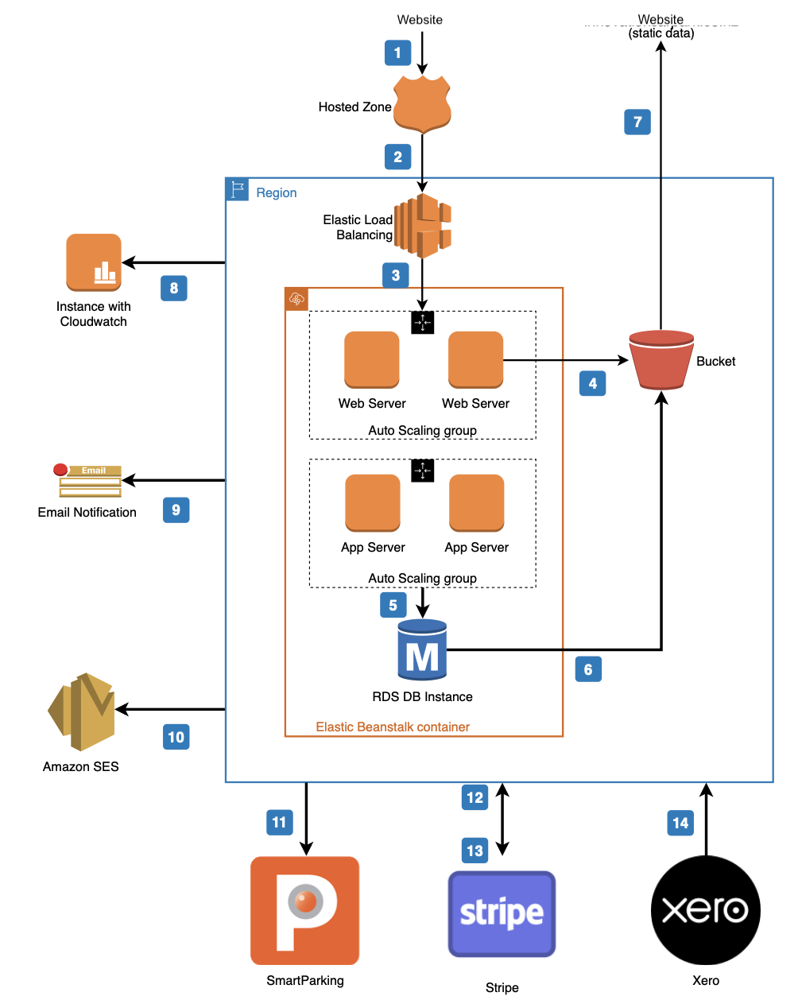

# Architecture

1. User Browsing Website, HTTP content request is sent to Route53 hosted zone. Available methods:
   - GET
     - Static web content (home page, FAQ)
     - User (fetch a user)
     - Tenancy (fetch all tenancies for a user)
     - Billing (get billing information, card details)
   - POST
     - Login (authentication)
     - User (create a user)
     - Forgot password (send password reset)
     - Tenancy (create a tenancy)
     - Contact form (contact carpark support)
     - Billing (create a Stripe customer)
   - UPDATE
     - User (update a user)
     - Tenancy (update a tenancy)
     - Billing (update a Stripe customer)
   - DELETE
     - Tenancy (delete a tenancy)
2. Request sent to Elastic load balancer, automatically distributes incoming traffic across multiple web and application servers.
3. Elastic load balancer sends request data to appropriate server
4. Static content request handled by web server and served through AWS S3 bucket (ie. web page)
5. Request to read/modify user or tenancy data is handled by server, then persisted to RDS database
6. The newly read/modified data from the RDS database instance is sent to the user via the AWS S3 bucket
7. Static/dynamic content sent via S3 bucket is served to frontend for consumption by end user
8. Cloudwatch monitors the AWS region for system and performance errors, triggers event to notify administrator
9. In the event of Cloudwatch detecting system or performance issues, email notification automatically sent to administrator
10. Amazon Simple Email Service (SES) used to send password reset and billing notifications to users
11. Create, update or delete a license plate through SmartParking. SmartParking internally handles request to open barrier arm
12. Stripe Webhooks, Handled Events:
    - Invoices
       - Success (payment succeeded) - send receipt to user
       - Failure (payment failed) - send failed payment notification to user, prompting card update
     - Credit Cards
       - Update - Reattempt failed invoices for user
13. Stripe Requests
    - CREATE
     - Customer (create a customer with the given card details)
     - Subscription (create a subscription for a newly created carpark tenancy)
   - UPDATE
     - Customer (update card details)
     - Subscription (update a subscription for a user with 1 vehicle type)
     - SubscriptionItem (update a subscription for a user with multiple vehicle types and tenancies)
   - DELETE
     - Subscription (delete a subscription for a user with no active tenancies remaining)
     - SubscriptionItem (delete a subscription item for a user with no active tenancies remaining for that vehicle type, but with tenancies remaining with other vehicles) 14. Fetch a corporate user’s billing information from Xero for frontend UI consumption

The API has been implemented using industry standard CRUD design principles and as such, provides an intuitive interface for data access and manipulation. A detailed overview of the API structure and endpoints can be provided on request.
